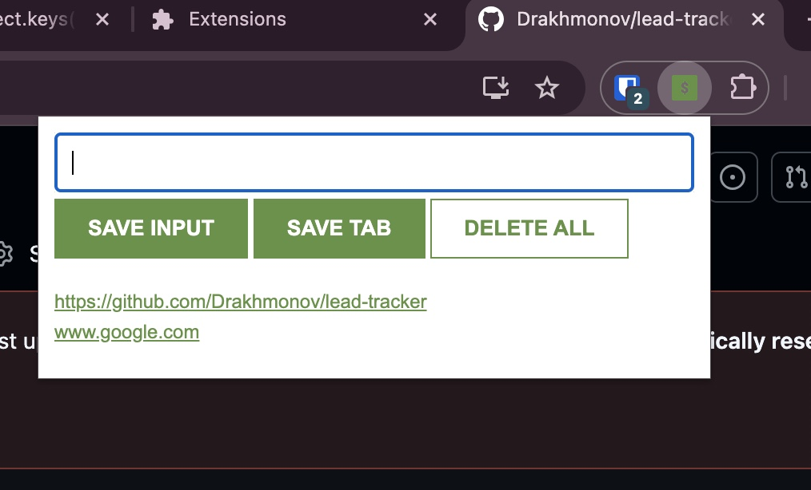

# 📎 Leads Tracker Chrome Extension

A simple and powerful **Chrome Extension** that lets you save and manage links (leads) directly from your browser.  
You can add URLs manually or save your **current active tab** with one click!

---

## 🚀 Features

- 🔗 **Save input links manually**  
  Type or paste a URL into the input field and click “SAVE INPUT” to store it.

- 🌐 **Save the current tab instantly**  
  Click “SAVE TAB” to automatically store the URL of the tab you’re currently viewing.

- 💾 **Persistent storage**  
  Your leads are saved in `localStorage`, so they stay even after you close Chrome.

- 🗑️ **Delete all leads**  
  Double-click the “DELETE ALL” button to clear all saved links.

- 📋 **Clickable links list**  
  All saved leads are displayed as clickable links in a clean list format.

---

## 🧠 How It Works

1. When you click **SAVE INPUT**, the app:
   - Takes the value from the input field  
   - Pushes it to an array called `myLeads`  
   - Saves it in `localStorage`  
   - Renders the list dynamically in the browser

2. When you click **SAVE TAB**, the app:
   - Uses the `chrome.tabs.query()` API  
   - Grabs the URL of the active tab  
   - Saves it in `myLeads` and `localStorage`

3. When you double-click **DELETE ALL**, the app:
   - Clears all stored data from `localStorage`  
   - Empties the list on the screen

---

## 🧩 Technologies Used

- HTML5  
- CSS3  
- JavaScript (Vanilla JS)  
- Chrome Extensions API  
- localStorage for data persistence  

---

## 🛠️ Installation

1. **Clone or download** this repository:
   ```bash
   git clone https://github.com/yourusername/leads-tracker.git
Open Google Chrome and go to:

chrome://extensions/


Turn on Developer Mode (top right corner).

Click Load unpacked and select your project folder.

The extension will now appear in your Chrome toolbar 🎉

🧪 Usage

Click the extension icon to open it.

Type or paste a link → click SAVE INPUT.

Or, open a page and click SAVE TAB to store that page instantly.

Double-click DELETE ALL to clear everything.

📷 Example


